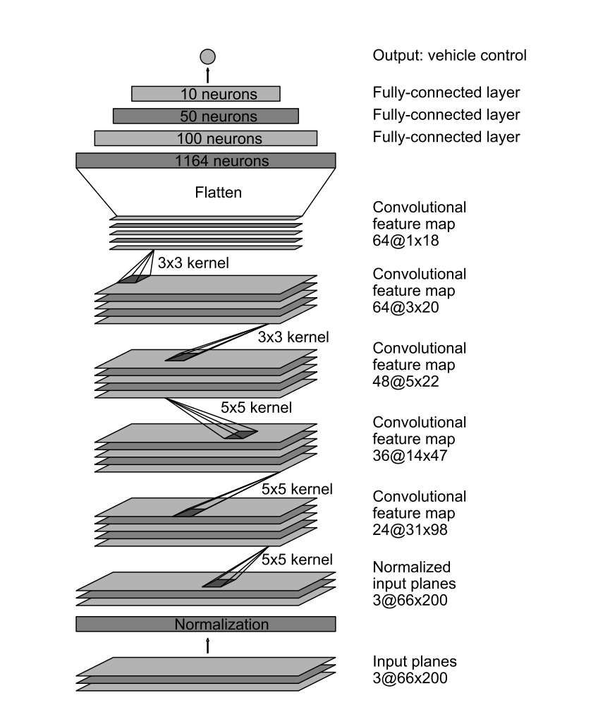
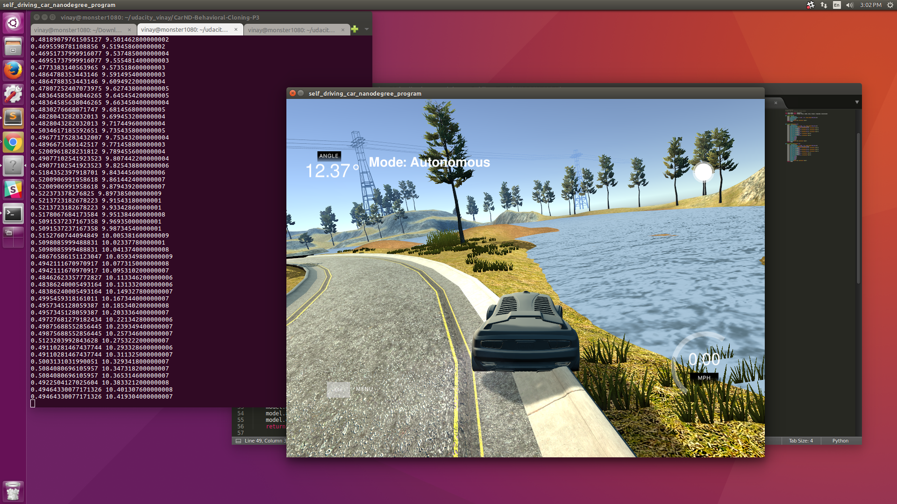
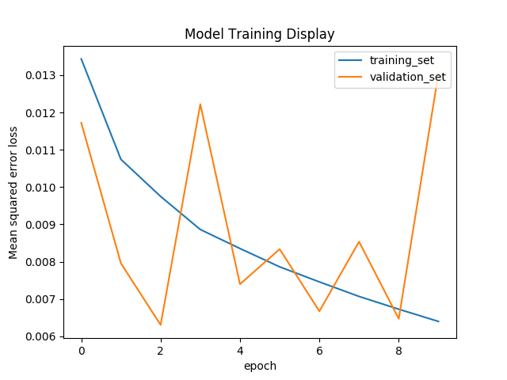

# Behavioral Cloning Project

This project is aimed to use the data collected from simulator to train a neural network to predict steering angles. As a part of this project, a convolutional neural network was trained with images and steering angles from Udacity simulator and the trained model was used to preditct the steering angles in the test run.

### Submission File Descriptions

- submission/project_report.md: Main project report (This file)
- coding/train.py: Code to train the neural network
- coding/retrain.py: Code used to retrained the neural network using previously trained models and additional data
- coding/utils.py: Misc python utilities used in train/retrain files
- coding/cnn_models.py: File with CNN architectures used for trainig

### Functional Model for Testing:

Project uses `coding/train.py` to generate `model.h5` file. And this depends on `coding/utils.py` and `coding/cnn_models.py` to define generators, cnn models and other useful functions. 

`coding/model_mod_nvidia.h5` is the final submission model and can be tested with:

```sh
python drive.py coding/model_mod_nvidia.h5
```


### Model Architecture

As a starting point, I just started with a flattened network to verify my workspace sanity and later moved to Nvidia\`s network defined [here](https://images.nvidia.com/content/tegra/automotive/images/2016/solutions/pdf/end-to-end-dl-using-px.pdf). This was a good starting point and I started implementing the exact same network to predict steering angles. The file `coding/cnn_models.py` defines a function called `nvidia_net` function which returns the network as Keras model. Below image shows the architecture:



This network was a good starting point, but could not complete the lap. Below image shows the car going off the road:



### Final Model

After some attempts at tuning the network parameter, I ended up getting better results with a modified nvidia netwokr which looks like this:

- 32 5x5 Convolutions + Relu + Dropout
- 64 5x5 Convolutions + Relu + Dropout
- 64 5x5 Convolutions + Relu + Dropout
- 96 3x3 Convolutions + Relu + Dropout
- 96 3x3 Convolutions + Relu + Dropout
- 100 Fully connected
- 50 Fully connected 
- 10 Fully connected
- 1 output

I ended up using this network, after couple of attempts at training different architectures and different data. This model performed really well compared to other attempts.


#### Data Collection

I used Udacity simulator track 1 to get the data for my experiments. Started with just one lap data and added more data with following techniques:

- Used multiple laps
- Asked a friend to drive a lap
- Drive in reverse direction
- Use left and right camera data
- Trying as much as possible to be in the center of the track

I defined a simple generator model in `sklearn` library to split Train and Validation data (80%/20%, random shuffled) in `coding/utils.py` in `parse_csv` function and defined a simple generator to feed that data into training and validation. Apart from this, I also used left and right images with correction angles to get more data for training.

Apart from the points mentioned above, I normalized each images and cropped the useful regions (track information only) for trainng and testing.

#### Parameter tuning

Couple of parameters were tuned to get the network train better apart from the architecture changes. 

- I tried 50%, 80% and 100% traing data as samples_per_epoch. Using all the data gave the best results.
- Out of 0.2, 0.15 and 0.1 for correction angles for right and left images, 0.15 gave the best results
- Batch size 32 gave a best result compared to 16, 64 and 128.

I used mean squared error loss function with Adam optimizer for my experiments. Using 0.001 learning rate gave good results on validation data compared to 0.01 and 0.0001. 


#### Overfitting

While training the network, I saw that training loss was continuously decreasing and validation loss was either going high or oscillating. Below image shows such behavior:



Even though training error was less, while I tested the model on the simulator, car went off the track and looked like this:


Finally, increasing the dropouts a bit solved the isse:

```python
def mod_nvidia_net(dropout=0.15):
	model = Sequential()
	model.add(Lambda(lambda x: x/255 - 0.5, input_shape=(160,320,3)))
	model.add(Cropping2D(cropping=((70,25),(0,0))))
	model.add(Convolution2D(32,5,5,subsample=(2,2), activation='relu'))
	model.add(Dropout(dropout))
	model.add(Convolution2D(64,5,5,subsample=(2,2), activation='relu'))
	model.add(Dropout(dropout+0.05))
	model.add(Convolution2D(64,5,5,subsample=(2,2), activation='relu'))
	model.add(Dropout(dropout+0.05))
	model.add(Convolution2D(96,3,3, activation='relu'))
	model.add(Dropout(dropout+0.1))
	model.add(Convolution2D(96,3,3, activation='relu'))
	model.add(Flatten())
	model.add(Dense(100))
	model.add(Dense(50))
	model.add(Dense(10))
	model.add(Dense(1))
	model.compile(loss='mse',optimizer='adam')
	return model
```

#### Final Model Output

This YouTube video link shows the cars driving by itself around the track and is able to one complete lap by itself:

[](https://www.youtube.com/watch?v=f7PiD1RR9co)


#### Discussion

Although the car was able to complete the one full lap by itself, these are the few thigs I would like to improve:

- Collect more data, may be from completely different Track-2 and see how well that generalizes
- Use slightly higher number of convolutions in the inner layers. This is what helped me come to my current model from nvidia's model. But, I want to look more into what caused that difference.

